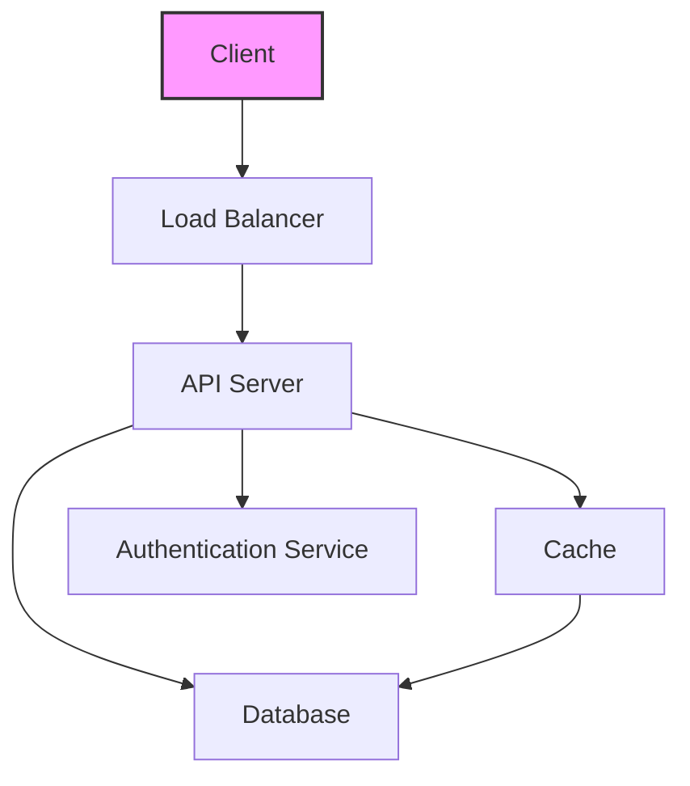

```mermaid
    graph TD
    A[Client] --> B[Load Balancer]
    B --> C[API Server]
    C --> D[Database]
    C --> E[Cache]
    E --> D
    C --> F[Authentication Service]
    
    classDef client fill:#f9f,stroke:#333,stroke-width:2px;
    class A client;
```